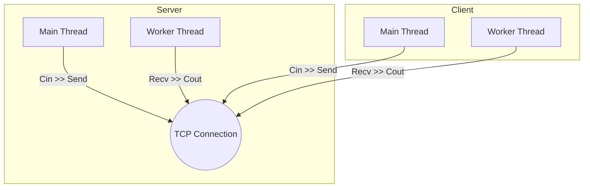

# 📡 Multithreaded TCP Chat Application


A robust, bidirectional Client-Server chat application built from scratch using **C++**, **Winsock2**, and **Multithreading**. This project demonstrates core networking concepts including the TCP 3-Way Handshake, socket lifecycle management, and non-blocking I/O via threading.

---

## Features

*   **Client-Server Architecture:** Distinct server and client implementations.
*   **TCP Protocol:** Ensures reliable, ordered delivery of messages without data loss.
*   **Multithreading (`std::thread`):**
    *   Separates **Sending** (Main Thread) and **Receiving** (Worker Thread).
    *   Allows users to type and receive messages simultaneously (Full Duplex).
*   **Graceful Shutdown:** Handles `exit` commands cleanly on both ends, closing sockets and terminating threads properly.
*   **Localhost Networking:** Configured to run locally on `127.0.0.1` port `8080`.

---

## Tech Stack

*   **Language:** C++ (Standard 14/17/20)
*   **Networking API:** Windows Sockets 2 (Winsock2 / `ws2_32.lib`)
---

## Architecture

The application uses a **multithreaded approach** to solve the blocking I/O problem.



1.  **Main Thread:** Handles User Input (`std::getline`) and sending data.
2.  **Receiver Thread:** Detached thread that loops `recv()` to listen for incoming data in the background.

---

## ️ Getting Started

### Prerequisites
*   Windows OS (Required for `<winsock2.h>`)
*   MinGW Compiler (GCC) or MSVC
*   CMake

### Installation & Build

**Option 1: Using CLion**
1.  Open the project in CLion.
2.  Reload the CMake project.
3.  Select `server` from the Run Configuration and press Play.
4.  Select `client` from the Run Configuration and press Play.

**Option 2: Using Command Line (MinGW)**
If you prefer the terminal, ensure you link the Winsock library (`-lws2_32`):

```bash
# Compile Server
g++ server.cpp -o server.exe -lws2_32

# Compile Client
g++ client.cpp -o client.exe -lws2_32
```

---

## How to Run

1.  **Start the Server first.**
    *   Open a terminal and run `server.exe`.
    *   It will display: `Server is now listening...`
2.  **Start the Client.**
    *   Open a second terminal and run `client.exe`.
    *   It will display: `Connected to server!`
3.  **Chat!**
    *   Type messages in either window and hit Enter.
4.  **Exit.**
    *   Type `exit` or `quit` to close the connection.

---

## Screenshots

---

## Learning Outcomes

This project was built to master the following concepts:
*   **Winsock Initialization:** `WSAStartup` and `WSACleanup`.
*   **Socket Lifecycle:** `socket`, `bind`, `listen`, `accept`, `connect`.
*   **Data Transfer:** `send` and `recv` with buffer management.
*   **Concurrency:** Using `std::thread` and `.detach()` for parallel execution.

---

## License

This project is open source. Feel free to use it for educational purposes.
